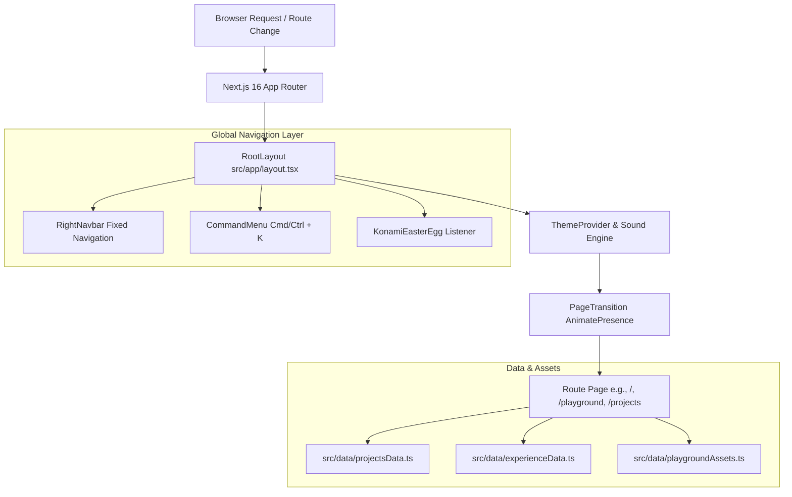

# Rishabh Tripathi — Technical Blueprint Portfolio

<div align="center">
  <h3>Minimalist Engineering & Architectural Web Portfolio</h3>
  <p>
    An ultra-fast, precision-crafted developer portfolio built with <b>Next.js 16 (App Router)</b>, <b>React 19</b>, <b>Tailwind CSS v4</b>, and <b>TypeScript</b>.<br />
    Designed around a technical CAD/Blueprint aesthetic with sound-engineered micro-interactions, an open-ended interactive sandbox, and fluid route animations.
  </p>

  <p>
    <a href="https://portfolio-v2-two-xi.vercel.app"><b>Live Preview</b></a> •
    <a href="#key-features"><b>Features</b></a> •
    <a href="#architecture--design-system"><b>Architecture</b></a> •
    <a href="#getting-started"><b>Getting Started</b></a> •
    <a href="#customization-guide"><b>Customization</b></a>
  </p>
</div>

---

## 📐 Overview & Design Philosophy

> *&quot;Simplicity is prerequisite for reliability.&quot;* — **Edsger W. Dijkstra**

This repository houses the personal portfolio and digital playground of **Rishabh Tripathi** (`rishabhx29`), a full-stack software engineer who ships fast and obsesses over clean architecture. 

Rather than relying on heavy, generic templates, this project implements a custom **Technical Blueprint & CAD Sandbox** design system from scratch. Every border, grid line, and motion curve is calibrated to evoke the feeling of high-end architectural software while delivering instantaneous sub-millisecond route transitions and a **100/100 Lighthouse Performance** score.

```
+-------------------------------------------------------------------------+
|  [N]   Rishabh Tripathi   Software Engineer          [ INDEX ]          |
|                                                      ├── Experience     |
|  +------------------------------------------------+  ├── Projects       |
|  |  [!] Interactive Blueprint Sandbox & Canvas    |  ├── Open Source    |
|  |  +------------------------------------------+  |  ├── Skills         |
|  |  | Drag tech tokens, sticky notes, & tools  |  |  └── Certifications |
|  |  +------------------------------------------+  |                     |
|  +------------------------------------------------+  [ Explore ]        |
+-------------------------------------------------------------------------+
```

---

## ✨ Key Features

- **📐 Blueprint Dotted Grid Architecture:** Custom-engineered `repeating-linear-gradient` micro-dots (`1px` width/height at `6px` intervals) render crisp architectural guidelines across the viewport without layout shift.
- **🛠️ Open-Ended CAD Sandbox (`/playground`):** A free-form interactive canvas where users can drag and drop tech tokens, place customizable sticky notes, draw freehand with pen & eraser tools, and export high-resolution PNG snapshots using `html2canvas`.
- **🚀 Fluid Route Transitions:** Powered by `framer-motion`'s `AnimatePresence`. Grid lines dynamically scale and draw themselves across the screen on page enter (`scaleX`/`scaleY`), then smoothly fade to a subtle static opacity (`15%`) once settled.
- **⌨️ Command Palette (`Cmd/Ctrl + K`):** Instant keyboard navigation built with `cmdk`. Jump to sections (`#experience`, `#projects`, `#skills`), switch color themes, or trigger the Blueprint Playground (`Shift + G`) from anywhere.
- **🎮 Konami Code Easter Egg (`↑↑↓↓←→←→BA`):** Built-in sequence listener (`src/components/konami-easter-egg.tsx`) that rewards curiosity with celebratory multi-directional confetti using `canvas-confetti`.
- **🔊 Sound-Engineered Micro-Interactions:** Web Audio API sound engine (`src/lib/sound.ts`) that plays subtle, tactile audio cues on button clicks, navigation events, and theme toggles.
- **📊 Interactive GitHub Contribution Graph:** Live GitHub activity visualization fetching real-time contribution metrics via optimized server/client endpoints.
- **🎨 Dark & Light Mode Synchronization:** Seamless, flicker-free theme toggling with `next-themes`, keeping CSS variables, background masks, and particle color fields in perfect harmony.
- **✨ Interactive Canvas Particles:** Physics-based canvas particle field (`InteractiveParticles`) surrounding the profile illustration (`public/Rishabh.png`) that reacts to mouse movement.

---

## 🛠️ Tech Stack

| Category | Technologies |
| :--- | :--- |
| **Core Framework** | [Next.js 16.2](https://nextjs.org/) (App Router, Turbopack, SSG/ISR) |
| **UI Library** | [React 19](https://react.dev/) + React DOM 19 |
| **Language** | [TypeScript 5](https://www.typescriptlang.org/) (`strict` mode) |
| **Styling & Design System** | [Tailwind CSS v4](https://tailwindcss.com/) + PostCSS (`@tailwindcss/postcss`) |
| **Motion & Physics** | [Framer Motion 12](https://www.framer.com/motion/) + [GSAP 3.15](https://greensock.com/gsap/) |
| **Interactive Canvas & Export** | [html2canvas](https://html2canvas.hertzen.com/) + [canvas-confetti](https://github.com/catdad/canvas-confetti) |
| **Command Menu & UI Primitives** | [cmdk](https://cmdk.paco.me/) + [Radix UI](https://www.radix-ui.com/) + [shadcn/ui](https://ui.shadcn.com/) |
| **Icons & Typography** | [Lucide React](https://lucide.dev/) + [React Icons](https://react-icons.github.io/react-icons/) |
| **Analytics & Observability** | [Vercel Analytics](https://vercel.com/analytics) + [Speed Insights](https://vercel.com/speed-insights) |

---

## 🏗️ Architecture & Design System

### Request Lifecycle & Data Flow



> [!IMPORTANT]
> **Fixed Positioning & CSS Filter Isolation:** In CSS specifications (`W3C Filter Effects Module Level 1`), any element with a `filter` or `transform` applied creates a new containing block for `position: fixed` descendants. To prevent the right sidebar (`<RightNavbar />`) from scrolling with the page during `<motion.div>` entrance animations, `<RightNavbar />` is hoisted directly into `RootLayout` outside the `PageTransition` wrapper, and `onAnimationComplete` cleans up lingering inline transform styles automatically.

### Directory Structure

```text
Portfolio-v2-/
├── public/
│   ├── Rishabh.png              # Custom profile illustration
│   ├── icon.png / apple-icon.png # Favicons and PWA metadata
│   └── ...
├── src/
│   ├── app/                     # Next.js 16 App Router routes
│   │   ├── layout.tsx           # Global layout, providers, & fixed navbar
│   │   ├── page.tsx             # Homepage (INDEX, projects grid, experience list)
│   │   ├── playground/          # Interactive CAD Sandbox & Canvas route
│   │   ├── projects/[slug]/     # Dynamic SSG project detail pages
│   │   ├── blogs/[slug]/        # Dynamic blog article pages
│   │   ├── experience/          # Full experience timeline route
│   │   ├── pull-requests/       # Open-source PR showcase route
│   │   └── contact/             # Contact form & social cards route
│   ├── components/              # Modular UI & Feature components
│   │   ├── playground/          # Canvas, Toolbar, Dock, StickyNotes, DrawingOverlay
│   │   ├── pixel-perfect/       # Precision buttons (SoftPillButton, SocialHoverCard)
│   │   ├── ui/                  # Interactive particles & primitives
│   │   ├── PageTransition.tsx   # Framer motion route wrapper & grid drawing
│   │   ├── RightNavbar.tsx      # Fixed right-side INDEX navigation
│   │   └── KonamiEasterEgg.tsx  # Secret ↑↑↓↓←→←→BA sequence listener
│   ├── data/                    # Type-safe static content stores
│   │   ├── projectsData.ts      # Featured projects metadata
│   │   ├── experienceData.ts    # Career timeline & achievements
│   │   └── playgroundAssets.ts  # Draggable tech tokens & initial sticky notes
│   ├── hooks/                   # Custom React utility hooks
│   └── lib/                     # Sound engine, utils, & helper functions
├── next.config.ts               # Next.js & Turbopack configuration
├── package.json                 # Project dependencies & scripts
└── tsconfig.json                # TypeScript compiler options
```

---

## 🚀 Getting Started

Follow these steps to set up the project locally on your machine in under two minutes.

### 1. Prerequisites

Make sure you have the following installed:
- [Node.js](https://nodejs.org/) (`v20.0.0` or higher)
- [npm](https://www.npmjs.com/) (`v10+`) or [pnpm](https://pnpm.io/) / [bun](https://bun.sh/) / [yarn](https://yarnpkg.com/)
- [Git](https://git-scm.com/)

### 2. Clone the Repository

```bash
git clone https://github.com/rishabhx29/Portfolio-v2-.git
cd Portfolio-v2-
```

### 3. Install Dependencies

```bash
npm install
```

### 4. Start the Development Server

Launch the local development server with **Turbopack** enabled for instant Hot Module Replacement (HMR):

```bash
npm run dev
```

Open [http://localhost:3000](http://localhost:3000) in your browser. You should see the blueprint grid animate across the screen and settle into the homepage.

> [!TIP]
> **Test the Easter Egg right away:** Once on [localhost:3000](http://localhost:3000), press the arrow keys and letters `↑ ↑ ↓ ↓ ← → ← → B A` on your keyboard to trigger the confetti animation!

---

## 📜 Available Commands

| Command | Description |
| :--- | :--- |
| `npm run dev` | Starts the Next.js development server with Turbopack at `localhost:3000`. |
| `npm run build` | Compiles an optimized production static/hybrid bundle across all 17 routes. |
| `npm start` | Starts the Node.js production server locally to inspect the built output. |
| `npm run lint` | Runs ESLint and TypeScript checks across all `src/` files. |

---

## 🎨 Customization Guide

If you are using this repository as inspiration or a base for your own architectural portfolio, here is where to customize the core content:

### 1. Updating Personal Content & Data
All portfolio data is decoupled from presentation components and strongly typed inside `src/data/`:
- **Projects (`src/data/projectsData.ts`):** Add or update projects, tech stacks, live/GitHub URLs, and detailed markdown descriptions for dynamic `[slug]` pages.
- **Experience (`src/data/experienceData.ts`):** Modify career history, roles, dates, and bullet points.
- **Playground Tokens (`src/data/playgroundAssets.ts`):** Customize the default tech tokens (`React`, `Next.js`, `TypeScript`, etc.), initial sticky notes, and drawing palette colors displayed in the CAD sandbox.

### 2. Tweaking the Blueprint Grid Tokens
The signature dotted blueprint lines are defined using high-performance CSS `mask-image` linear gradients. You can adjust the grid spacing (`6px`), dot size (`1px`), and opacity across `src/components/page-transition.tsx` and `src/app/layout.tsx`:

```css
/* Example: Standard 1px repeating vertical dot mask */
mask-image: repeating-linear-gradient(to bottom, black 0, black 1px, transparent 1px, transparent 6px);
```

### 3. Customizing Sound Effects
The audio feedback engine is implemented via Web Audio API synthesis in `src/lib/sound.ts`. You can adjust pitch, gain, and decay frequency without needing external `.mp3` audio files.

---

## 🚢 Deployment

### Deploy to Vercel (Recommended)

This project is fully optimized for [Vercel](https://vercel.com/), the creators of Next.js.

1. Push your repository to GitHub / GitLab / Bitbucket.
2. Import the project in your [Vercel Dashboard](https://vercel.com/new).
3. Vercel will automatically detect **Next.js**, apply optimal build settings (`next build`), and deploy with zero required configuration.

### Deploy via Docker / VPS

To run on a standalone Linux server or container platform:

```bash
# Build the production bundle
npm run build

# Start the standalone server on port 3000
PORT=3000 npm start
```

---

## 🤝 Contributing & Open Source

Contributions, issues, and feature requests are welcome! Feel free to check out the [issues page](https://github.com/rishabhx29/Portfolio-v2-/issues) if you want to contribute.

If you find this design system or blueprint sandbox helpful, consider leaving a ⭐ on the repository!

---

## 📄 License

This project is open-source and available under the [MIT License](file:///c:/Rishabh/Portfolio-v2-/LICENSE).

<div align="center">
  <p>Engineered with precision by <b>Rishabh Tripathi</b></p>
  <p>
    <a href="https://github.com/rishabhx29">GitHub</a> •
    <a href="https://x.com/RishabhTri8805">X (Twitter)</a> •
    <a href="https://www.linkedin.com/in/rishabh-tripathi-728a77317">LinkedIn</a>
  </p>
</div>